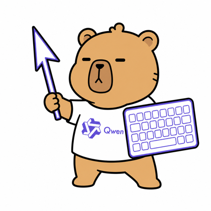
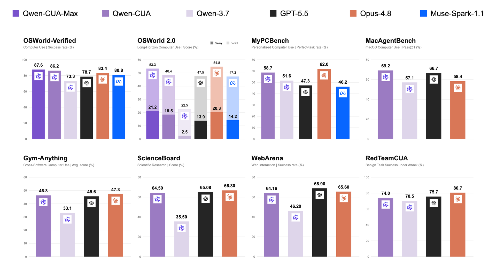
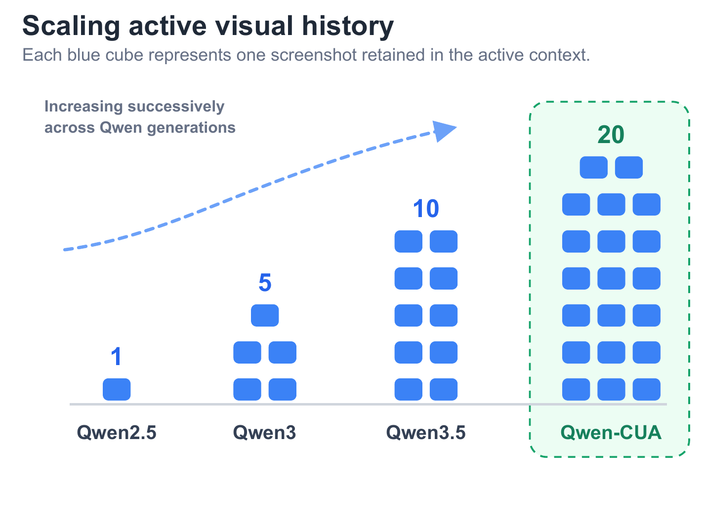
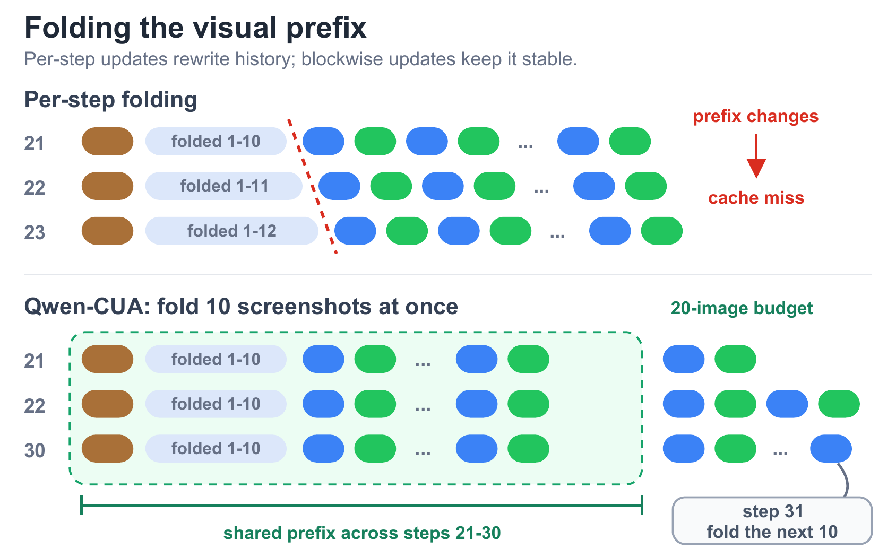
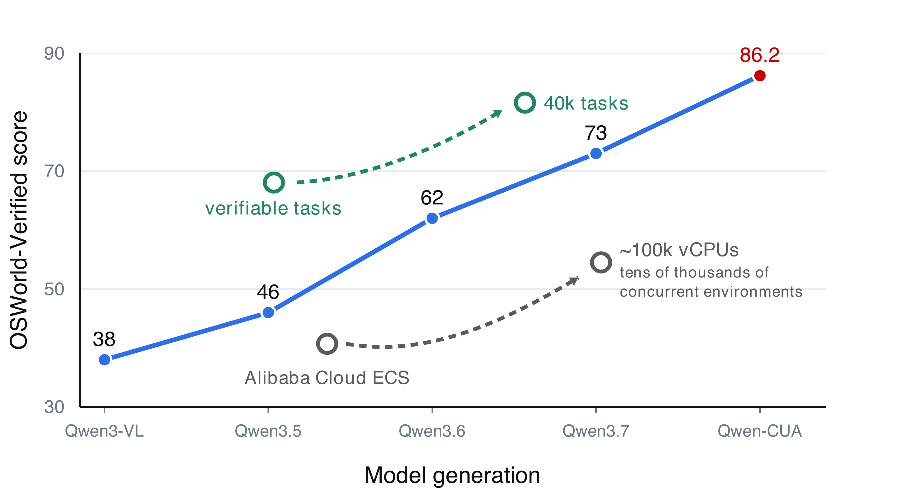
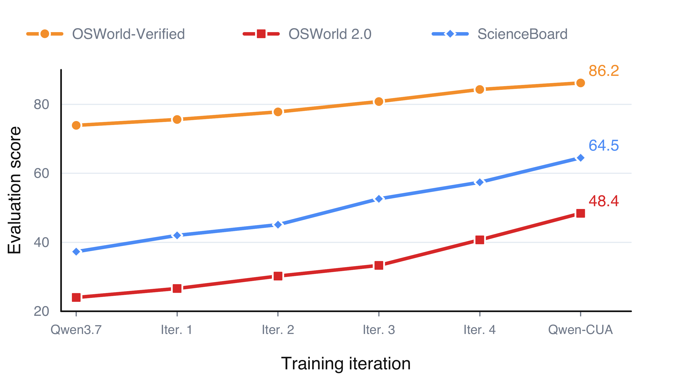
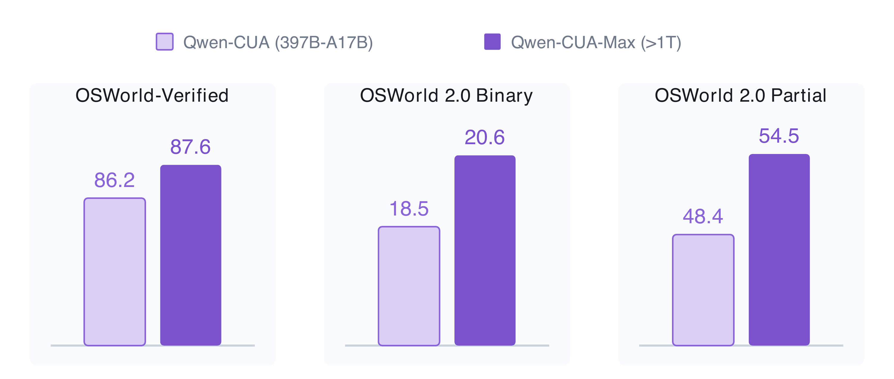
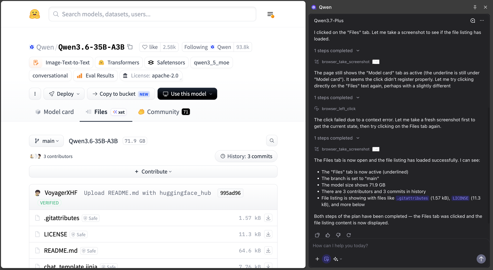

<div align="center">
  
  <h1>Qwen-CUA: Native Computer Use for (almost) Everything</h1>
  <p>
    A Qwen-based computer-use model and agent that sees screenshots,<br>
    reasons over visible state, and acts through native keyboard and mouse events.
  </p>
  <p>
    <a href="https://arxiv.org/abs/2608.02352"></a>
    <a href="./paper/Qwen-CUA.pdf"></a>
    <a href="./demo/README.md"></a>
    <a href="./LICENSE"></a>
  </p>
</div>

<p align="center">
  <a href="./paper/Qwen-CUA.pdf">
    
  </a>
</p>
<p align="center"><sub>Eight benchmark families, from desktop control and long-horizon work to web interaction and adversarial robustness. Click the figure for the technical report.</sub></p>

<table>
  <tr>
    <td align="center" width="33%"><strong>86.2</strong><br><sub>OSWorld-Verified</sub></td>
    <td align="center" width="33%"><strong>20 images / turn</strong><br><sub>active visual history</sub></td>
    <td align="center" width="33%"><strong>~100k vCPUs</strong><br><sub>rollout infrastructure</sub></td>
  </tr>
</table>

## One model. One native interface. Almost any software.

Qwen-CUA operates from pixels rather than hidden application state. It receives the same visual evidence available to a person and produces actions in a shared keyboard-and-mouse space—without DOM trees, accessibility metadata, shell access, or task-specific APIs.

| **Qwen-CUA model** | **Agent runtime** |
| --- | --- |
| Understands screenshots and instructions, tracks progress, reasons about the visible interface, and proposes grounded native actions. | Captures observations, manages multimodal history, validates and executes actions, requests approval, and preserves replay evidence. |

## Remember what matters

Long computer-use trajectories accumulate image-heavy context quickly. Qwen-CUA keeps a larger active visual history, then folds older screenshots in blocks so the agent can preserve task state while reusing a stable prefix.

<table>
  <tr>
    <td width="46%" valign="top">
      <a href="./assets/readme/visual-history.png"></a>
      <p align="center"><strong>More visual memory</strong><br><sub>Twenty recent screenshots stay active.</sub></p>
    </td>
    <td width="54%" valign="top">
      <a href="./assets/readme/context-folding.png"></a>
      <p align="center"><strong>Stable long-horizon context</strong><br><sub>Blockwise folding bounds growth and improves prefix reuse.</sub></p>
    </td>
  </tr>
</table>

## Learn from verifiable experience

Qwen-CUA scales computer-use training along two axes: broader verifiable tasks and rollout capacity across model generations, followed by successive training runs in which the current policy exposes unresolved queries and weak domains. Those diagnostics refresh both the supervised data mixture and the verifiable RL task distribution before the next run.

<table>
  <tr>
    <td width="50%" valign="top">
      <a href="./assets/readme/training-scale.png"></a>
      <p align="center"><strong>Scaling training resources</strong><br><sub>From 1k to 40k tasks and nearly 100k vCPUs.</sub></p>
    </td>
    <td width="50%" valign="top">
      <a href="./assets/readme/successive-training-runs.png"></a>
      <p align="center"><strong>Successive training runs</strong><br><sub>SFT data and verifiable RL tasks are refreshed between runs.</sub></p>
    </td>
  </tr>
</table>

Each SFT run starts from the same mid-training checkpoint instead of continually fine-tuning the previous agent checkpoint. The resulting SFT model recalibrates the RL pool with eight trial rollouts per task, retaining queries that are neither unreachable nor already saturated. Because teacher policies, data mixtures, domain coverage, and task distributions change between runs, the plotted lines connect development checkpoints rather than measuring controlled convergence or scaling.

## Scale the model, scale the ceiling

The same computer-use recipe extends from **Qwen-CUA (397B-A17B)** to **Qwen-CUA-Max (>1T)**. The larger model reaches **87.6 on OSWorld-Verified** and improves both binary and partial-credit performance on OSWorld 2.0.

<p align="center">
  <a href="./assets/readme/model-scaling.png">
    
  </a>
</p>

## From benchmark to real workflows

Qwen-CUA is designed for the interaction loop users actually see: inspect the page, plan, act, recover when the interface changes, and verify the result.

<p align="center">
  <a href="./assets/readme/chrome-showcase.png">
    
  </a>
</p>

The self-contained [`demo/`](./demo/README.md) turns that loop into a local, browser-first reference agent:

| **Operator console** | **Safety gates** | **Replayable runs** |
| --- | --- | --- |
| Inspect screenshots, actions, approvals, and raw model responses. | Pause sensitive actions and isolate every Playwright browser session. | Save events, screenshots, downloads, and deterministic verification evidence. |

```bash
git clone https://github.com/xlang-ai/Qwen-CUA.git
cd Qwen-CUA/demo
cp .env.example .env
```

Then follow the [demo quick start](./demo/README.md#native-quick-start) to connect an OpenAI-compatible multimodal endpoint and launch the operator console.

## Repository

```text
Qwen-CUA/
├── paper/          # Technical report
├── demo/           # Runnable browser-agent reference implementation
├── assets/readme/  # Figures used in this overview
├── LICENSE
└── README.md
```

> [!NOTE]
> This release contains the technical report and reference demo. Model weights are not included in the repository.

## Citation

If you find Qwen-CUA useful in your work, please cite our technical report:

```bibtex
@misc{lu2026qwencuanativecomputeruse,
      title={Qwen-CUA: Native Computer Use for (almost) Everything},
      author={Dunjie Lu and Shuai Bai and Tianyi Bai and Sicheng Fan and Chang Gao and Jian Guan and Feng Hu and Mianqiu Huang and Xingyang Huang and Yizhen Jiang and Yuheng Jing and Dehui Kong and Ning Li and Dayiheng Liu and Shixuan Liu and Zheng Liu and Que Shen and Bowen Wang and Junli Wang and Chencan Wu and Rui Xie and Tianbao Xie and Zhihui Xie and Haiyang Xu and An Yang and Tao Yu and Wenzhen Yuan and Xi Zhang and Zhenru Zhang and Mingkang Zhu and Zhaoqing Zhu and Yizhong Cao and Kai Dang and Binyuan Hui and Kaixin Li and Junyang Lin and Haiquan Wang and Zekun Wang and Yiheng Xu and Fan Yan and Mengqi Yuan and Danyang Zhang and Jiajun Zhang and Zhipeng Zhang and Fan Zhou and Fan Zhou},
      year={2026},
      eprint={2608.02352},
      archivePrefix={arXiv},
      primaryClass={cs.LG},
      url={https://arxiv.org/abs/2608.02352},
}
```

## Safety

Computer-use agents can make mistakes, encounter prompt injection, and trigger consequential interface actions. Use isolated browser contexts, avoid authenticated or high-stakes workflows, and require human approval for sensitive operations. A model declaring success is not proof that the intended real-world outcome was achieved.

## License

Apache-2.0. See [LICENSE](./LICENSE) and [NOTICE](./NOTICE).
